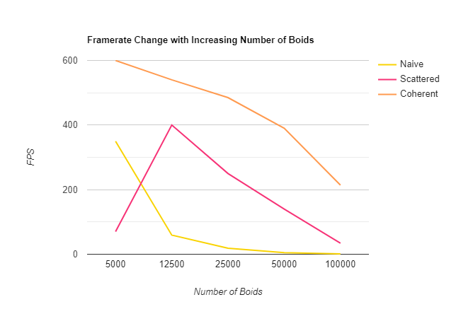
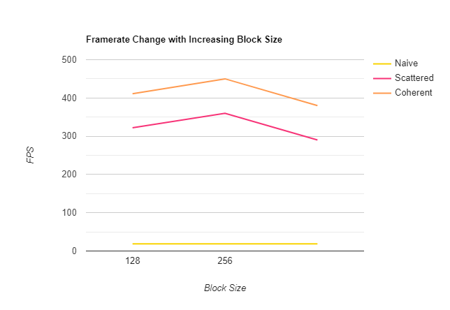

**University of Pennsylvania, CIS 565: GPU Programming and Architecture,
Project 1 - Flocking**

* Alexis Ward
  * [LinkedIn](https://www.linkedin.com/in/alexis-ward47/), [personal website](https://www.alexis-ward.tech/)
* Tested on: Windows 10, i7-8750H CPU @ 2.20GHz 16GB, GTX 1050 Ti (Same borrowed computer as last time, for the second half of the assignment.)

# README

I still have yet to get my new laptop, so for the beginning of the project, I borrowed Nick Magarino's. My first few commits are from his git account because of that, but he has not touched my code.

## Graphs

For each implementation, increasing the number of boids decreases the framerate, because we have more items to process.

For each implementation, changing the block size has a varying effect. For the naive, it makes no change, I think because we are not relying on the grid to organize our boids.

Until I charted it, I thought the coherent uniform grid had no performance improvements in my code, but it made it run faster! This is because we do not have to compare the shuffled and unshuffled buffers.

Changing cell width to 27 dramatically decreased the frame rate. This could have made my program check more empty neighboring cells than neighboring boids.

Interestingly, when visualize mode is disabled, my program sometimes has a hard time runninng less than 10000 boids.

Include screenshots, analysis, etc. (Remember, this is public, so don't put
anything here that you don't want to share with the world.)
